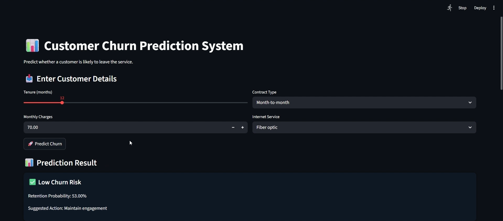
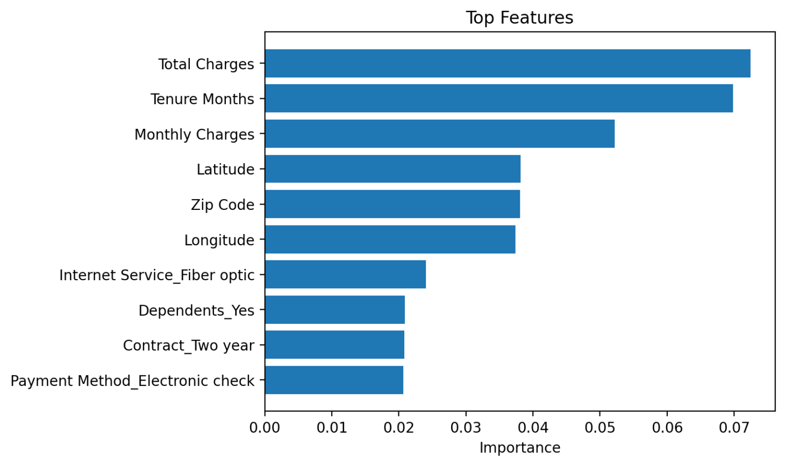
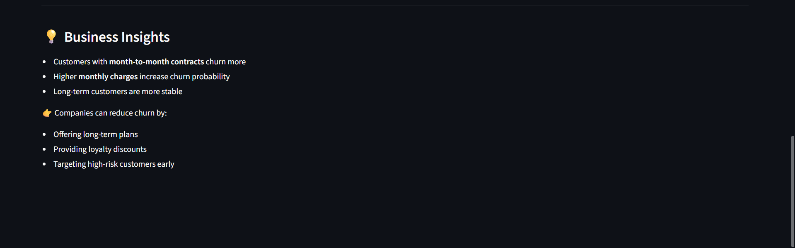

# 📊 Customer Churn Prediction System

## 📌 Problem

Customer churn is a major challenge for telecom companies. This project predicts whether a customer is likely to leave the service based on their behavior, subscription type, and billing details.

---

## 🚀 Features

* End-to-end Machine Learning pipeline
* Data preprocessing & feature engineering
* Handling real-world dataset issues (missing values, encoding, leakage)
* Model training & comparison
* Streamlit web application
* Real-time prediction with probability
* Feature importance visualization

---

## ⚙️ Tech Stack

* Python
* Pandas, NumPy
* Scikit-learn
* XGBoost
* Streamlit

---

## 🔄 Workflow

1. Data Cleaning
2. Feature Engineering
3. Handling Data Leakage
4. Model Training
5. Evaluation (Accuracy, Precision, Recall)
6. Deployment using Streamlit

---

## 📊 Models Used

* Logistic Regression
* Random Forest
* XGBoost

---

## 📈 Results

* Best Model: Random Forest
* Accuracy: ~80%
* Model produces realistic churn probabilities

---

## 💡 Business Insights

* Customers with **month-to-month contracts** have higher churn risk
* Higher **monthly charges** increase probability of churn
* Customers with longer tenure are more stable

👉 Business actions:

* Offer long-term plans
* Provide targeted discounts
* Identify high-risk customers early

---

## 🖥️ Demo





---

## 📂 Project Structure

```
customer-churn-prediction/
│
├── data/
│   ├── raw/
│   ├── processed/
│
├── src/
│   ├── data_preprocessing.py
│   ├── feature_engineering.py
│   ├── train_model.py
│   ├── evaluate_model.py
│
├── models/
│   ├── model.pkl
│   ├── columns.json
│
├── app/
│   └── app.py
│
├── notebooks/
│   └── eda.ipynb
│
├── main.py
├── requirements.txt
└── README.md
```

---

## ▶️ Run Locally

```bash
python -m venv venv
venv\Scripts\activate
pip install -r requirements.txt
python main.py
streamlit run app/app.py
```

---

## 👨‍💻 Author

Adhipatya Saxena
